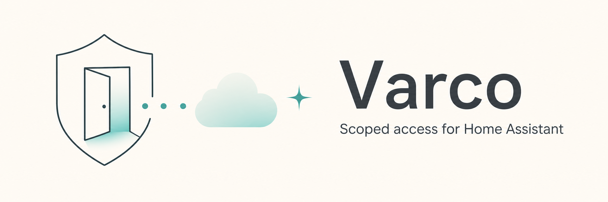

# Varco

Varco is a relay-first access layer for Home Assistant. It lets an external consumer, such as a dashboard, script, or agent-facing app, request narrowly scoped access to Home Assistant without receiving a Home Assistant token and without exposing Home Assistant directly to the internet.

Home Assistant acts as the **Authority**. It keeps the long-lived credentials, approves or rejects consumers, stores grants, enforces every permission, and connects outbound to an opaque WebSocket bridge.

## Status

Varco is an early MVP/prototype. The core pieces in this repository are implemented and covered by tests, but the API and grant model may still change.


## Live demo

Open the Gazzetta-style energy dashboard: [`varco-demo.andreabaccega.com`](https://varco-demo.andreabaccega.com/). It is a running browser demo and should load live energy data without pairing or login.

The demo is a browser-only consumer backed by a synthetic Home Assistant showcase instance. It connects through Varco with a pre-approved read-only grant for only the energy entities used by the dashboard. The browser does not receive a Home Assistant token; Varco still routes through the relay and the Home Assistant Authority enforces the grant.

Related demo endpoints:

- Home Assistant showcase: [`varco-ha.andreabaccega.com`](https://varco-ha.andreabaccega.com/)
- Varco Authority panel: [`varco-ha.andreabaccega.com/varco`](https://varco-ha.andreabaccega.com/varco)

## What is in this repository?

- `custom_components/varco/`: Home Assistant custom integration. It provides the Authority, consent storage, grant enforcement, audit events, a `/varco` admin panel, and Home Assistant services.
- `bridge/`: Cloudflare Worker plus Durable Object relay. It routes encrypted envelopes between consumers and the Authority.
- `packages/client/`: browser TypeScript client (`@varco/client`).
- `examples/consumer-dashboard/`: minimal external dashboard consumer.
- `examples/gazzetta-energy-showcase/`: read-only energy dashboard showcase.
- `tests/`: Python tests for Authority behavior and policy enforcement.

## Core guarantees

- Consumers never receive a Home Assistant long-lived access token.
- Home Assistant does not need an inbound public URL for Varco traffic.
- Grants are bound to a consumer public key and stored inside Home Assistant.
- The Authority enforces scopes on every data-plane message.
- The bridge is opaque: it sees routing metadata, timing, and payload size, but not Home Assistant states, service calls, history, camera data, or grant contents.
- Revocation is enforced by the Authority and active sessions are marked closed.

## Quick start for Home Assistant owners

1. Copy `custom_components/varco` into your Home Assistant `config/custom_components/varco` directory.
2. Restart Home Assistant.
3. Go to **Settings -> Devices & services -> Add integration -> Varco**.
4. Keep the default bridge URL unless you are running your own bridge:

   ```text
   wss://varco-bridge.vekexasia.workers.dev
   ```

5. Open the **Varco** sidebar panel, or browse to `/varco`.
6. Copy the **Authority ID** from the panel and paste it into the consumer app.
7. When the consumer requests access, compare the pairing code shown by the consumer with the one in Home Assistant, then approve or reject the request in the Varco panel.

Full owner instructions: [`docs/home-assistant.md`](docs/home-assistant.md).

## Quick start for consumer developers

Inside this repository:

```bash
npm install
npm run build
npm test
```

Minimal browser client:

```ts
import { createVarcoConsumerClient } from "@varco/client";

const client = createVarcoConsumerClient({
  authorityId: "PASTE_AUTHORITY_ID_FROM_HOME_ASSISTANT",
  bridgeUrl: "wss://varco-bridge.vekexasia.workers.dev",
  manifest: {
    name: "My dashboard",
    version: "0.1.0",
    read_entities: ["sensor.temperature"],
    subscriptions: ["sensor.temperature"],
    history: [],
    camera_snapshots: [],
    actions: [],
  },
});

const access = await client.requestAccess();
console.log(access.pairing_code);

// After the Home Assistant owner approves the request:
await client.connect();
const states = await client.getStates(["sensor.temperature"]);
```

The same high-level client can also run inside a Home Assistant custom card with `createVarcoConsumerClient({ hass })`, using the already-authenticated frontend session instead of Varco pairing.

Full client guide: [`docs/consumer-integration.md`](docs/consumer-integration.md).

## Documentation

- [`docs/home-assistant.md`](docs/home-assistant.md): install, configure, approve, reject, revoke, and troubleshoot from Home Assistant.
- [`docs/consumer-integration.md`](docs/consumer-integration.md): integrate a browser consumer with `@varco/client`.
- [`docs/protocol.md`](docs/protocol.md): actors, relay flow, encryption boundaries, messages, and security invariants.
- [`docs/development.md`](docs/development.md): repository development commands, local Home Assistant dev instance, and remote showcase deployment.
- [`AGENTS.md`](AGENTS.md): LLM-friendly project guide for coding agents working in this repository.
- [`llms.txt`](llms.txt): compact index for LLM tools and retrieval systems.

## Development

Development-only setup and commands are kept in [`docs/development.md`](docs/development.md).

## Home Assistant services

Varco exposes service fallbacks for automation or manual service calls:

- `varco.approve_request` with `request_id`
- `varco.reject_request` with `request_id`
- `varco.revoke_grant` with `grant_id`
- `varco.delete_grant` with `grant_id`

The admin panel is available at `/varco` after the integration is loaded.
