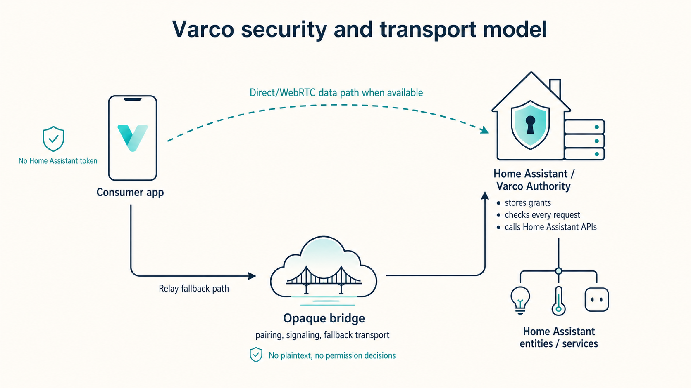

Varco lets external apps use Home Assistant without receiving a Home Assistant token and without requiring Home Assistant to be publicly reachable.

A consumer asks for a narrow grant. The Home Assistant owner approves or rejects it in the Varco panel. From then on, every read, subscription, history query, camera snapshot, or service call is checked against that stored grant by Home Assistant itself.

## Why Varco?

Home Assistant integrations usually assume that trusted code runs inside Home Assistant, or that external tools receive a Home Assistant access token. That is awkward for dashboards, scripts, AI agents, or one-off consumers that should only see a few entities or perform a few actions.

Varco separates access from credentials:

- Consumers never receive a Home Assistant long-lived access token.
- Home Assistant does not need an inbound public URL for Varco traffic.
- The bridge can carry encrypted envelopes, but does not make permission decisions and is not necessarily on every data path.
- Home Assistant remains the Authority for consent, grants, policy checks, service calls, and audit.

## What is it useful for?

Varco is useful when an app inside or outside Home Assistant needs limited access to Home Assistant data or actions, but should not receive a broad Home Assistant token.

Common examples:

- **External dashboards** that show only the entities they need, such as energy, climate, or room status.
- **Shared family or guest dashboards** that expose only a safe subset of Home Assistant, for example selected lights, climate controls, guest-room sensors, or energy views, without giving friends or family broad access to the full instance.
- **Internal Home Assistant dashboards** built as custom cards or panel experiences. These can use the existing authenticated `hass` object with Varco's client shape, making it easier to build polished, creative dashboards that communicate with Home Assistant through the same scoped interface.
- **Read-only AI agents** that can inspect selected sensors, binary sensors, and history without being allowed to change devices or call services.
- **Agent-built companion apps** generated from a Lovelace dashboard brief, then paired back to Home Assistant with an explicit manifest.
- **One-off scripts or browser tools** that need temporary, revocable access to a narrow set of entities.
- **Custom consumer apps** that should ask the Home Assistant owner for consent before reading states, subscribing to updates, querying history, requesting camera snapshots, or calling approved services.

The important distinction is that access is granted by capability, not by handing over a reusable Home Assistant credential.

## Try the live demo

Open the Gazzetta-style energy dashboard: [`varco-demo.andreabaccega.com`](https://varco-demo.andreabaccega.com/).

The demo is a browser-only consumer backed by a synthetic Home Assistant showcase instance. It connects through Varco with a pre-approved read-only grant for only the energy entities used by the dashboard.


## How it works



1. A consumer declares the entities, subscriptions, history queries, camera snapshots, and actions it wants.
2. The Home Assistant owner reviews the request in the Varco panel.
3. If approved, Home Assistant stores a grant bound to the consumer public key.
4. The consumer connects using the best available transport: direct/WebRTC when possible, or the relay path for pairing, signaling, and fallback.
5. The Authority enforces the stored grant on every data-plane message, regardless of transport.
6. The owner can revoke or delete the grant from Home Assistant.

## Core guarantees

- Consumers never receive a Home Assistant long-lived access token.
- Home Assistant does not need an inbound public URL for Varco traffic.
- Grants are bound to a consumer public key and stored inside Home Assistant.
- The Authority enforces scopes on every data-plane message.
- The bridge is opaque: when traffic uses the relay path, it sees routing metadata, timing, and payload size, but not Home Assistant states, service calls, history, camera data, or grant contents.
- Revocation is enforced by the Authority and active sessions are marked closed.

## Who is this for?

### Home Assistant owners

Use Varco when you want to let an external app access part of your Home Assistant instance without giving that app a Home Assistant token.

Start here: [`docs/home-assistant.md`](docs/home-assistant.md)

You will learn how to:

- install the custom integration;
- find your Authority ID;
- pair a consumer;
- approve, reject, revoke, or delete grants;
- troubleshoot relay and panel issues.

### AI agent access

Use Varco when you want an AI agent to inspect selected Home Assistant context without giving it broad read/write access.

For example, an owner could approve a read-only grant for:

- room temperature and humidity sensors;
- energy usage sensors;
- battery levels;
- selected binary sensors;
- history for a narrow set of entities.

The agent can read only what the manifest requests and the owner approves. Service calls remain unavailable unless the grant explicitly includes matching action scopes.

### Consumer developers

Use `@varco/client` when you are building a browser dashboard, custom Home Assistant card, panel experience, script, or agent-facing tool that needs scoped Home Assistant access.

Start here: [`docs/consumer-integration.md`](docs/consumer-integration.md)

You will learn how to:

- declare a consumer manifest;
- request access from a Home Assistant owner;
- connect after approval;
- read states;
- subscribe to live updates;
- query history;
- request camera snapshots;
- call Home Assistant services within the approved grant.

### Maintainers and protocol readers

Start here: [`docs/protocol.md`](docs/protocol.md)

You will find details about:

- actors and trust boundaries;
- bridge endpoints;
- pairing and grant flow;
- encryption boundaries;
- application messages;
- scope semantics;
- WebRTC fallback behavior;
- security invariants.

## Quick start for Home Assistant owners

1. Copy `custom_components/varco` into your Home Assistant `config/custom_components/varco` directory.
2. Restart Home Assistant.
3. Go to **Settings -> Devices & services -> Add integration -> Varco**.
4. Keep the default bridge URL unless you are running your own bridge:

   ```text
   wss://varco-bridge.vekexasia.workers.dev
   ```

5. Open the **Varco** sidebar panel, or browse to `/varco`.
6. Copy the **Authority ID** from the panel and paste it into the consumer app.
7. When the consumer requests access, compare the pairing code shown by the consumer with the one in Home Assistant, then approve or reject the request in the Varco panel.

The `/varco` panel can also export an existing Lovelace dashboard or view into a local agent brief zip (`brief.md` plus `manifest.json`) so a coding agent can scaffold a consumer from the owner's current dashboard choices.

## Quick start for consumer developers

Inside this repository:

```bash
npm install
npm run build
npm test
```

Minimal browser client:

```ts
import { createVarcoConsumerClient } from "@varco/client";

const client = createVarcoConsumerClient({
  authorityId: "PASTE_AUTHORITY_ID_FROM_HOME_ASSISTANT",
  bridgeUrl: "wss://varco-bridge.vekexasia.workers.dev",
  manifest: {
    name: "My dashboard",
    version: "0.1.0",
    read_entities: ["sensor.temperature"],
    subscriptions: ["sensor.temperature"],
    history: [],
    camera_snapshots: [],
    actions: [],
  },
});

const access = await client.requestAccess();
console.log(access.pairing_code);

// After the Home Assistant owner approves the request:
await client.connect();
const states = await client.getStates(["sensor.temperature"]);
```

The same high-level client can also run inside a Home Assistant custom card with `createVarcoConsumerClient({ hass })`, using the already-authenticated frontend session instead of Varco pairing.

## Repository map

- `custom_components/varco/`: Home Assistant custom integration. It provides the Authority, consent storage, grant enforcement, audit events, a `/varco` admin panel, and Home Assistant services.
- `bridge/`: Cloudflare Worker plus Durable Object relay. It routes encrypted envelopes between consumers and the Authority.
- `packages/client/`: browser TypeScript client (`@varco/client`).
- `examples/consumer-dashboard/`: minimal external dashboard consumer.
- `examples/gazzetta-energy-showcase/`: read-only energy dashboard showcase.
- `tests/`: Python tests for Authority behavior and policy enforcement.

## Status

Varco is an early MVP/prototype. The core pieces in this repository are implemented and covered by tests, but the API and grant model may still change.

## Documentation

- [`docs/home-assistant.md`](docs/home-assistant.md): install, configure, approve, reject, revoke, and troubleshoot from Home Assistant.
- [`docs/consumer-integration.md`](docs/consumer-integration.md): integrate a browser consumer with `@varco/client`.
- [`docs/protocol.md`](docs/protocol.md): actors, relay flow, encryption boundaries, messages, and security invariants.
- [`docs/development.md`](docs/development.md): repository development commands, local Home Assistant dev instance, and remote showcase deployment.
- [`AGENTS.md`](AGENTS.md): LLM-friendly project guide for coding agents working in this repository.
- [`llms.txt`](llms.txt): compact index for LLM tools and retrieval systems.

## Development

Development-only setup and commands are kept in [`docs/development.md`](docs/development.md).

## Home Assistant services

Varco exposes service fallbacks for automation or manual service calls:

- `varco.approve_request` with `request_id`
- `varco.reject_request` with `request_id`
- `varco.revoke_grant` with `grant_id`
- `varco.delete_grant` with `grant_id`

The admin panel is available at `/varco` after the integration is loaded.
